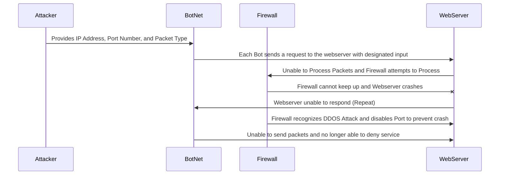

#DDOS Attack Sequence
The Diagram above is a visual representation of the interaction between an Attacker, Botnet, Firewall, and Webserver in the event that the Attack is attempting to DDOS the Webserver.

##The Attack
The first step in which an attacker must take to initiate a DDOS attack is to indicate what the network IP address is hence the Direct name in Direct Denial of Service. This information is then provided to the botnet setup by the attacker.

##The Botnet
A Botnet for explanation sake is a network of computers infected by an attacker typically these computers are standard home computers who have unknowingly been compromised. The Botnet receives the information provided and will then replicate identical packets of information and attempt to repeatedly send them to the target server.

##The WebServer
The Webserver in this case has one of two outcomes both depending on the abilities of its Firewall which we will get two in the next section. For now lets discuss the outcomes. In the event that the firewall is capable the Webserver will remain unaffected by the DDOS attack except for potential hiccups in performance such as loading slower. However, in the event the firewall is NOT capable the Webserver will be unable to process the amount of incoming traffic and soon crash unable to transmit data. The only solution for this outcome is to reboot the server and attempt to increase the strength of your infrastructure / firewall.

##The Firewall
This is by far the most important node within the entire process of a DDOS Attack as it will determine if the attack is successful or not. A Firewall that is capable of detecting and preventing a DDOS attack will recognize an influx of identical packets and immediately turn off the port which is receiving said packets. This action will mitigate the DDOS Attack and render is mostly harmless. A Firewall that is NOT capable of detecting this however will not know how to respond and fail to take action before any detrimental effects take place.