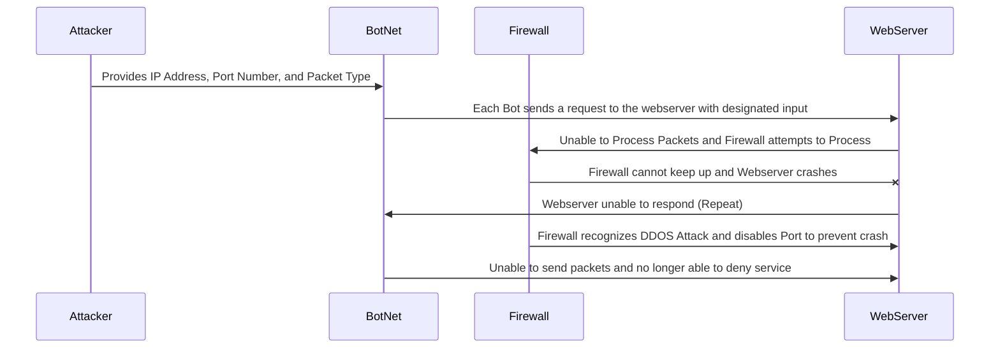

```mermaid
sequenceDiagram
participant Attacker
participant BotNet
participant Firewall
participant WebServer


	Attacker ->> BotNet: Provides IP Address, Port Number, and Packet Type
	BotNet ->> WebServer: Each Bot sends a request to the webserver with designated input
	WebServer ->> Firewall: Unable to Process Packets and Firewall attempts to Process
	Firewall -x WebServer: Firewall cannot keep up and Webserver crashes
	WebServer ->> BotNet: Webserver unable to respond (Repeat)
	Firewall ->> WebServer: Firewall recognizes DDOS Attack and disables Port to prevent crash
	BotNet ->> WebServer: Unable to send packets and no longer able to deny service
```
